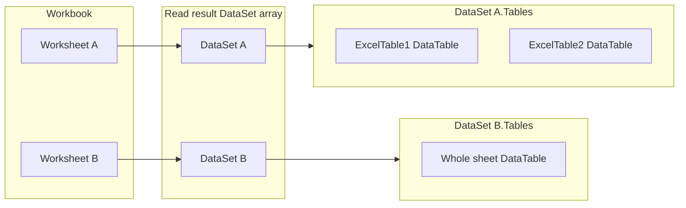

# Epic 002: Excel workbook as array of per-sheet datasets

## Summary

Extend `analyticsLibrary.Excel` so a workbook can be read as an **ordered array of `DataSet` instances**: each **worksheet** is one array element, and each element’s **`Tables` collection** holds every **Excel structured table** (Insert → Table / ListObject) found on that sheet. When a sheet has **no** structured tables, fall back to **one `DataTable`** built from the **full used range** (row 1 headers, remaining rows data), matching today’s flat read behavior for that sheet.

Reading **must support `.xlsx`, `.xls`, and `.xlsb`** using **FOSS dependencies only**—permissive license (e.g. MIT, Apache-2.0), **no** vendor license registration, **no** PolyForm/commercial EPPlus-style acceptance steps.

**Do not use EPPlus at all:** remove the **`EPPlus` package reference** from [`analyticsLibrary.Excel`](../../src/analyticsLibrary.Excel/analyticsLibrary.Excel.csproj) and eliminate **every** use of `OfficeOpenXml` types in production code, tests, and docs (see **Public API impact**). Align **documentation**, **NuGet metadata**, and **tests** entirely with the replacement FOSS stack.

Existing **`getSheetData(string fileName)`** callers should keep working; behavior may move internally to the new reader stack while preserving output semantics (document any intentional deltas).

**Canonical plan:** This document is the source of truth for epic 002 (not Cursor’s temporary plan UI).

## Goals

- Return **`DataSet[]`** (or equivalent `IReadOnlyList<DataSet>`) where **index order matches workbook worksheet order**.
- For each worksheet:
  - Set **`DataSet.DataSetName`** to the **sheet name** (documented contract).
  - If the sheet has **one or more** Excel structured tables, emit **one `DataTable` per table** with **`TableName`** from the Excel table name (handle duplicates within the sheet by suffixing).
  - If the sheet has **no** Excel tables, emit **exactly one `DataTable`** from the **full used range** (same semantics as current `getSheetData` per-sheet logic).
- **Formats:** **`getWorkbookSheetDatasets`** (and modernized read paths) accept **`.xlsx`, `.xls`, `.xlsb`** (detect by extension and/or content where appropriate).
- **No EPPlus:** The Excel package must **not** reference or call EPPlus anywhere—only FOSS libraries under **OSI-approved permissive** licenses with **no runtime license API** (no `ExcelPackage`, `LicenseContext`, or `OfficeOpenXml` types).
- **Documentation:** Update [`README.md`](../../README.md) (package table, licensing subsection that today discusses EPPlus 5.8.14 / PolyForm), [`src/analyticsLibrary.Excel/analyticsLibrary.Excel.csproj`](../../src/analyticsLibrary.Excel/analyticsLibrary.Excel.csproj) (`Description`, `PackageReleaseNotes`, `PackageTags` as needed), and XML remarks on public APIs describing formats and table semantics.
- **Testing:** Replace EPPlus-only tests; add coverage for **multi-table** sheets, **whole-sheet fallback**, **worksheet order**, and **at least one golden-path read per format** (xlsx, xls, xlsb)—prefer **committed small fixtures** under `tests/` or generate minimal files in code if fixtures are impractical.

## Non-Goals

- **Retaining EPPlus** for any code path (reads, writes, tests, or samples)—removal is **complete** in this epic’s scope.
- Detecting arbitrary non-table rectangular regions on a sheet (only **Excel structured tables** + whole-sheet fallback).
- **Guaranteeing write support for `.xlsb`** under FOSS (many stacks read xlsb well but do not write it; if writes remain OleDb/NPOI/xlsx-only, document explicitly).
- Resolving overlaps between multiple Excel tables on one sheet beyond documenting behavior (default: read each table independently).

## Dependency and licensing (EPPlus fully removed)

**Requirement:** **Zero EPPlus.** Use FOSS components only—no PolyForm NonCommercial dependency, no commercial unlock steps, no `OfficeOpenXml` surface area.

**Implementation approach (pick after a short spike):**

1. **Unified row/sheet reading across xlsx / xls / xlsb** — Strong candidate: **[ExcelDataReader](https://github.com/ExcelDataReader/ExcelDataReader)** (MIT). Register encoding provider on .NET Core if needed for legacy `.xls`.
2. **Structured Excel tables (ListObject)** — Row readers alone may **not** expose table bounds/names. Likely need either:
   - **[NPOI](https://github.com/npoi/NPOI)** (Apache-2.0) for parts of the pipeline where **sheet + table metadata + cell ranges** are required (especially **`.xlsx`** `XSSFTable`), while using another reader for **`.xlsb`** / **`.xls`** if NPOI coverage is uneven, **or**
   - A hybrid: ExcelDataReader for tabular data + **Open XML SDK** (`DocumentFormat.OpenXml`, MIT) to parse `xl/tables/*.xml` for **`.xlsx`** table definitions only, with separate logic for **`.xls`** / **`.xlsb`** table metadata as supported.

**Spike outcome should record:** chosen packages, how table names/ranges are resolved per format, and failure modes (e.g. workbook with tables on xlsx vs legacy xls).

**Write paths today** (all EPPlus-based: `writeSheetDataXlsx`, `getSheet`, `copySheet`, `removeWorksheet`, formatting helpers, etc. in [`excelLibrary.cs`](../../src/analyticsLibrary.Excel/excelLibrary.cs)): **must** be reimplemented using FOSS (**NPOI** and/or **ClosedXML** for **`.xlsx`**; **NPOI HSSF** for **`.xls`** where required). **`.xlsb` write** remains optional (see Non-Goals); if unsupported, document clearly and throw or no-op per API contract—**never** fall back to EPPlus.

## Current State

Primary implementation: [`src/analyticsLibrary.Excel/excelLibrary.cs`](../../src/analyticsLibrary.Excel/excelLibrary.cs).

Today, reads use **EPPlus** (`ExcelPackage`, worksheets, `Dimension`). **`getSheetData(string fileName)`** returns one **`DataSet`** with **one `DataTable` per worksheet**; **Excel tables are not enumerated**.

Tests: [`tests/analyticsLibrary.Excel.Tests/ExcelTests.cs`](../../tests/analyticsLibrary.Excel.Tests/ExcelTests.cs) sets **`ExcelPackage.LicenseContext = NonCommercial`**.

Docs: [`README.md`](../../README.md) describes EPPlus pinning and PolyForm Noncommercial constraints.

## Target Model

## Proposed Public API (names illustrative)

Add static methods on **`excelLibrary`** (camelCase consistent with existing API):

- **`getWorkbookSheetDatasets(string fileName)`** → **`DataSet[]`**: one `DataSet` per worksheet; supports **`.xlsx`, `.xls`, `.xlsb`**.
- **`getWorkbookSheetDatasets(Stream stream, string formatHintOrExtension)`** (or overload with **`ExcelReaderFactory`**-compatible options): for in-memory tests and callers without a file path.

**Public API impact:** Today’s API exposes EPPlus types (e.g. **`ExcelWorksheet`**, **`ExcelPackage`** flows via `getSheet` / `getExcelConnection`, **`ExcelHorizontalAlignment`**). This epic **replaces or removes** those members so **no public API** depends on `OfficeOpenXml.*`. Breaking changes require **migration notes** in README and `PackageReleaseNotes` (major version bump if packages are versioned semantically).

## Implementation Outline

1. **Spike (short):** Select FOSS stack for (a) sheet enumeration + cell grid for all three formats, (b) structured table metadata where available, (c) **all write scenarios** currently covered by EPPlus; document decision in this epic or `docs/` technical note if lengthy.
2. **Shared helper** — Internal **range → `DataTable`** (header row + data, duplicate column naming) parameterized by **1-based row/column bounds**, with **no** EPPlus types.
3. **Structured tables** — For each Excel table on a sheet, resolve **name + address** via chosen API; build `DataTable` per table; suffix duplicate names on the same sheet.
4. **Fallback** — No tables on sheet → single `DataTable` for used range (same rules as today).
5. **Empty sheet** — Document whether result is **zero tables** vs **one empty table** when there is no used range.
6. **Legacy `getSheetData` / `getExcelSheetNames`** — Reimplement on top of shared reader or delegate to same primitives so behavior and format support stay consistent; note **breaking** risk only if semantics change—prefer parity.
7. **Remove `EPPlus` PackageReference** and delete dead code; verify **no** `OfficeOpenXml` usings remain in the repo for this package (including **`Directory.Packages.props`** / central versioning if used).

## Testing

- **Formats:** Assert readable grid content for **xlsx, xls, xlsb** (same logical workbook shape where feasible).
- **Multi-table / fallback / order:** Same scenarios as before, at least on **xlsx** (where table metadata is easiest); add spot checks that **xls/xlsb** fall back path does not throw and returns expected dimensions for simple fixtures.
- **No `LicenseContext`** in test project for the new stack.
- Remove or rewrite **`EPPlus_Workbook_RoundTrip_InMemory`**—replace with FOSS-based fixture test or reader smoke test.

## Migration / Consumers

- Callers adopting **`getWorkbookSheetDatasets`** get per-sheet multi-table semantics and multi-format read support per documented extensions.
- **`getSheetData`** remains at the **method name** level where feasible; document expanded **xls/xlsb** support and any semantic deltas.
- **Breaking:** Any code that took **`ExcelWorksheet`** / **`ExcelPackage`** from this library must migrate to new abstractions (file-path APIs, streams, or FOSS types if deliberately exposed—prefer hiding vendor types behind **`analyticsLibrary.Excel`** wrappers).

## Risks and Notes

- **Table metadata on `.xls` / `.xlsb`** may differ from **`.xlsx`**; document what is supported after the spike.
- **xlsb writing** may remain unsupported under FOSS—call out in README if reads succeed but writes do not.
- **Overlapping tables:** duplicate cells across `DataTable`s unless validated—document.
- **Filename:** This file is `epic-002-excel-remodel.plan .md` (space before `.md`). Consider renaming to `epic-002-excel-remodel.plan.md` for consistency with epic 001.

## Implementation Checklist

- [ ] Spike: choose FOSS packages for grid read (xlsx/xls/xlsb) + table metadata strategy.
- [ ] Implement shared range → `DataTable` helper (non-EPPlus).
- [ ] Implement `getWorkbookSheetDatasets` (+ stream overload); wire **xlsx, xls, xlsb**.
- [ ] Port **`getSheetData` / `getExcelSheetNames`** (and related reads) to same stack for consistent format support.
- [ ] Port **all write** APIs (and OleDb-only paths if still needed) to FOSS; **no EPPlus** anywhere.
- [ ] Remove **`EPPlus`** package reference and **all** `OfficeOpenXml` usages from Excel project and tests.
- [ ] Tests: fixtures per format; multi-table + fallback + ordering; **no** EPPlus or `LicenseContext`.
- [ ] Documentation: README, csproj metadata, API remarks; **remove EPPlus/PolyForm sections**; document breaking API changes and replacement FOSS stack + licenses.
